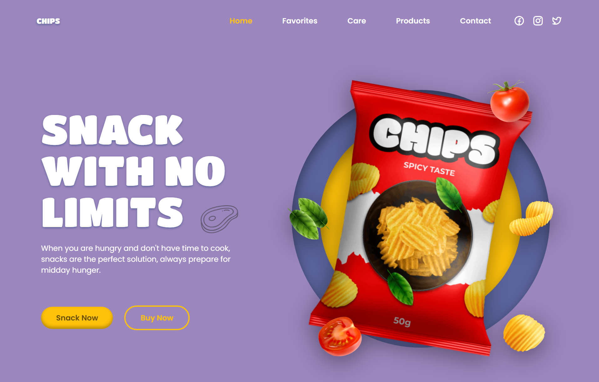
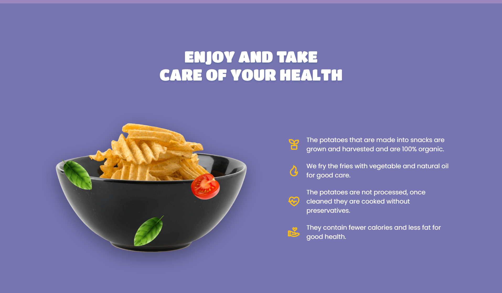

   &nbsp;
   

# Responsive Chips Website
A fully responsive Chips website showcasing different chips products with multiple sections: Home, Favourite, Care, Products, and Contact. Built with HTML, CSS, JavaScript.

## Features
- **Responsive Design**: Works perfectly on desktop, tablet, and mobile devices.
- **Home Section**: Eye-catching hero banner with website introduction.
- **Favourite Section**: Highlights the most popular chips.
- **Care Section**: Information about health tips and care related to snacks.
- **Products Section**: Showcases all available chips products with images.
- **Contact Section**: Contact form to reach out for queries or feedback.
  
## Technologies Used
- HTML5
- CSS3
- JavaScript
- Bootstrap 5 + Media query
## Live Demo
[View Live Website](https://webbyhosna.github.io/chips-website/)

## Installation
1. Clone the repository:  
   `git clone https://github.com/webbyhosna/chips-website.git`
2. Open `index.html` in your browser.
3. 
## Author
- [Asma Ul Hosna](https://github.com/webbyhosna)
